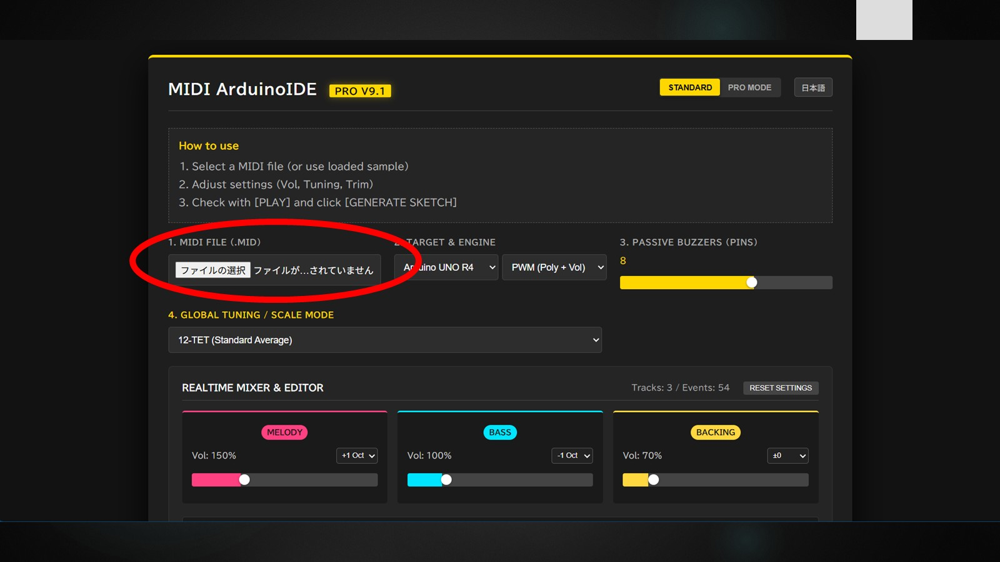
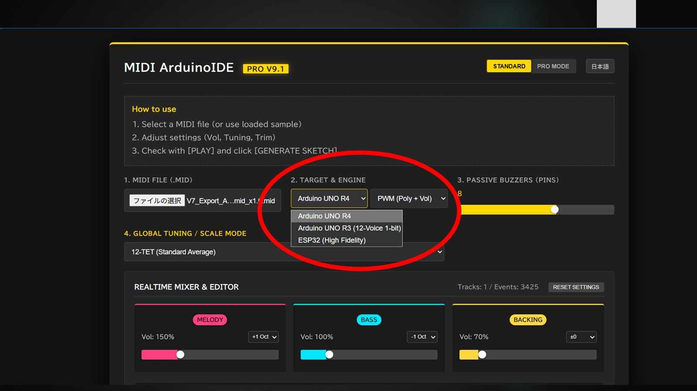
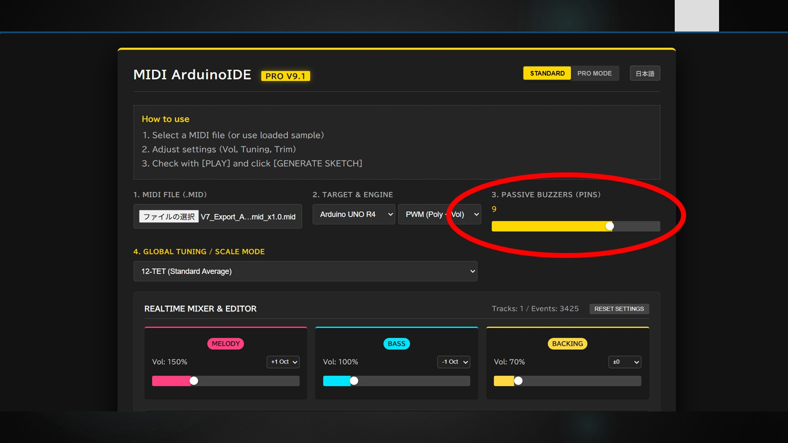
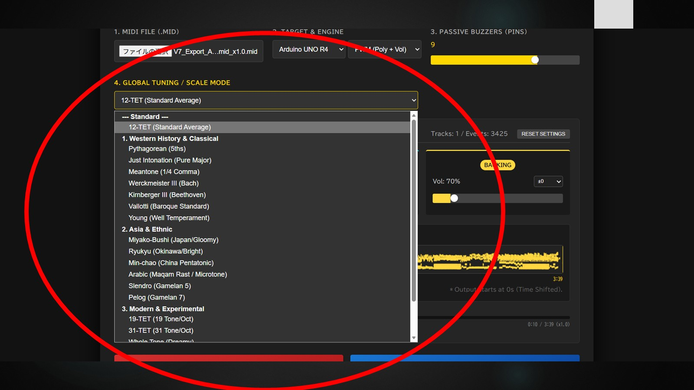
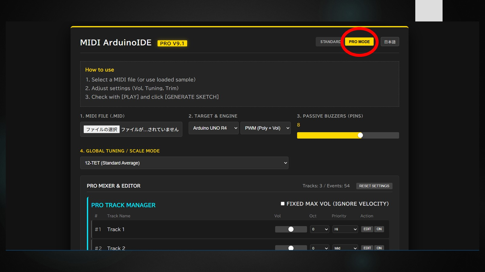
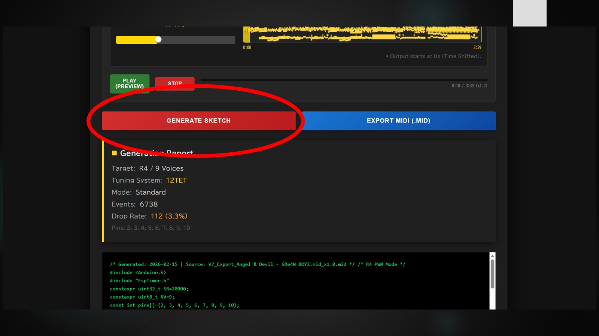
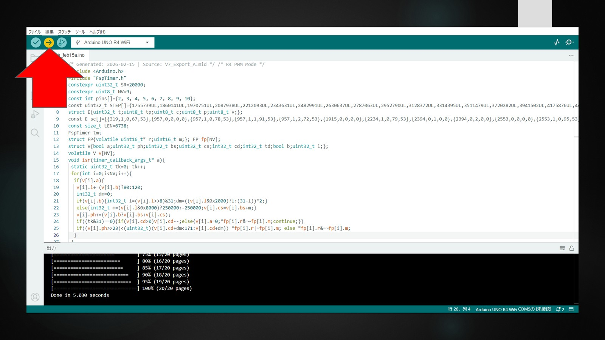

MIDI ArduinoIDE PRO
===================
Simply copy and paste your MIDI data into the Arduino IDE to instantly generate a playable program. It supports everything from single notes to polyphonic performances utilizing up to 28 buzzers.
(お手持ちのMIDIデータを、Arduino IDEにコピー＆ペーストするだけで即座に演奏可能なプログラムを出力します。単音から、最大28個のブザーを駆使した多音演奏まで幅広く対応しています。)

Turn your Arduino into a Polyphonic Synthesizer with just Passive Buzzers.
(パッシブブザーだけで、Arduinoを多重和音シンセサイザーに変身させるWebツールです。)

対応マイコンは以下になります。

【Arduino UNO R4】を選択した場合 : Arduino UNO R4 Minima , Arduino UNO R4 WiFi
【Arduino UNO R3】を選択した場合 : Arduino UNO R3（互換機含む） , Arduino Nano (V3.0 / ATmega328P版) , Arduino Pro Mini (5V / 16MHz版) , Arduino Mini
【ESP32】を選択した場合 : ESP32-WROOM-32 , ESP32-S3 , ESP32-C3 , M5Stack シリーズ , M5Atom / M5StickC , Seeed XIAO ESP32C3 / S3
【Raspberry Pi Pico / Pico 2】を選択した場合 : Raspberry Pi Pico / Pico W , Raspberry Pi Pico 2 , RP2040-Zero , Seeed XIAO RP2040 , Adafruit Feather RP2040 , Pro Micro RP2040 , SparkFun Pro Micro - RP2040
※マイコンによってはピン設定を編集する必要があります。

[Open Application (Latest V9.3)](https://kazuma-maker.github.io/midi-buzzer-arduino/?v=9.3)

Demo Video
----------
Listen to the sound generated by this tool!
(実際の動作デモはこちら)

Overview
--------
This tool runs entirely in your web browser. It converts standard MIDI files (.mid) into optimized C++ source code for Arduino UNO R4, R3, and ESP32.
(このツールはブラウザ上で動作し、標準的なMIDIファイルをマイコン用の最適化されたC++コードに変換します。)

Its main feature is the ability to perform rich polyphonic music (chords and harmony) using multiple passive buzzers.
(最大の特徴は、複数のパッシブブザーを使用して、和音やハーモニーを含む重厚な演奏を可能にすることです。)

Features
--------
- Rich Polyphony
  Supports up to 12 voices simultaneously.
  (最大12個のブザーを制御し、アンサンブルを実現。)

- Dual Engines (New in V9.1)
  PWM Mode (R4/ESP32): Volume control and clear sound.
  1-Bit DDS Mode (R3/R4): Retro, memory-optimized engine that works even on ATmega328P.
  (R4/ESP32用の高音質PWMモードに加え、R3でも動作するレトロな1-bitエンジンを搭載。)

- Professional Mixer (PRO Mode)
  Real-time volume mixing, octave shifting, and priority management for each track.
  (トラックごとの音量、オクターブ、発音優先度を細かく設定可能。)

- Advanced Tuning Systems
  Supports 20+ tuning systems including Just Intonation, Pythagorean, Gamelan, Microtonal, etc.
  (純正律、ピタゴラス音律、ガムランなど、20種類以上の音律をサポート。)

Wiring Guide
------------
Connect the Positive (+) pin of the buzzers to the GPIO pins below, and all Negative (-) pins to GND.
(ブザーのプラス側を指定のピンへ、マイナス側をGNDへ接続します。)

Pin Mapping Table:

| Voice No. | Arduino UNO R4 | Arduino UNO R3 | ESP32 |
| :---: | :---: | :---: | :---: |
| 1 | D2 | D2 | GPIO 26 |
| 2 | D3 | D3 | GPIO 25 |
| 3 | D4 | D4 | GPIO 27 |
| 4 | D5 | D5 | GPIO 32 |
| 5 | D6 | D6 | GPIO 33 |
| 6 | D7 | D7 | GPIO 19 |
| 7 | D8 | D8 | GPIO 18 |
| 8 | D9 | D9 | GPIO 21 |
| 9 | D10 | D10 | GPIO 22 |
| 10 | D11 | D11 | GPIO 23 |
| 11 | D12 | D12 | GPIO 13 |
| 12 | D13 | A0 (Pin 14) | GPIO 12 |

Note for UNO R3: Voice 12 uses Analog Pin A0 as a digital output.

Follow these steps to generate your Arduino sketch.
(以下の手順に従って、Arduino用スケッチを生成してください。)

How to Use
----------
1. Load MIDI File
Click the button to upload your .mid file.
(ボタンをクリックして、MIDIファイルをアップロードします。)

2. Select Target Board and Engine
Choose your microcontroller (Arduino UNO R4, R3, or ESP32) and the sound engine.
(使用するマイコンボードとサウンドエンジンを選択します。)

3. Set Voice Count
Adjust the slider to match the number of passive buzzers connected to your board.
(ボードに接続されているパッシブブザーの数に合わせてスライダーを調整します。)

4. Select Tuning System (Optional)
You can change the tuning system from standard 12-TET to various scales like Pythagorean or Gamelan.
(標準の平均律だけでなく、ピタゴラス音律やガムランなど、様々な音律に変更できます。)

5. Edit and Mix
Use the mixer to adjust volume balance, change octaves, or trim the playback range.
(ミキサーを使って音量バランスやオクターブを変更したり、再生範囲をトリミングしたりできます。)

Tip: Switch to PRO MODE
Click the PRO MODE button for advanced track-by-track editing and priority settings.
(PRO MODEボタンを押すと、トラックごとの詳細な編集や優先度設定が可能です。)

6. Generate Sketch
Click the GENERATE SKETCH button to create the C++ code.
(ボタンをクリックして、C++コードを生成します。)

7. Upload to Arduino
Copy the generated code, paste it into the Arduino IDE, and click the Upload button.
(生成されたコードをコピーしてArduino IDEに貼り付け、書き込みボタンを押してください。)

License
MIT License

